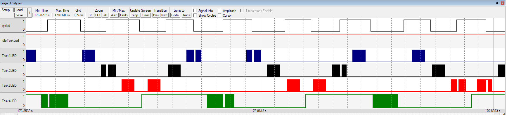

# ARM Cortex RTOS

This project is a Real-Time Operating System (RTOS) implemented for the ARM Cortex family. It includes features such as task scheduling, mutexes, and more.

## Features

### Task Scheduling
- **Priority-based Scheduling**: Tasks are scheduled based on their priority levels.
- **Task States**: Tasks can be in one of the following states: `Suspended`, `Waiting`, `Ready`, `Running`.
- **AutoStart**: Tasks can be configured to start automatically.

### Mutexes
- **Mutual Exclusion**: Mutexes are used to prevent multiple tasks from accessing shared resources simultaneously.
- **Priority Inversion Handling**: The system handles priority inversion scenarios.

## Getting Started

### Prerequisites
- ARM Cortex development environment
- C compiler (e.g., GCC for ARM)

### Installation
1. Clone the repository:
    ```sh
    git clone https://github.com/OmarZakaria10/My-Real-Time-Operating-System.git
    ```
2. Navigate to the project directory:
    ```sh
    cd My-Real-Time-Operating-System
    ```

### Running the RTOS
1. Compile and Flash the compiled binary to your ARM Cortex device.
2. Reset the device to start the RTOS.


## Usage

### Task Creation
Tasks are defined and created in the `main.c` file. Here is an example:

```c
#include "Scheduler.h"

void task1() {
    // Task code here
}

int main(void) {
    TASK Task1;
    Task1.Stack_Size = 1024;
    Task1.p_TaskEntry = task1;
    Task1.Priority = 1;
    strcpy(Task1.TaskName, "task_1");

    MYRTOS_CreateTask(&Task1);
    MYRTOS_ActivateTask(&Task1);
    MYRTOS_StartOS();

    while (1) {
        // Main loop
    }
}
```
### Scheduling Tasks with Mutex Inversion example
